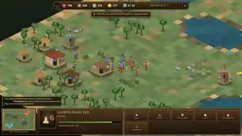

# First Empire

**First Empire** is an original classical-age real-time strategy game built as a clean-room homage to the foundational 1990s historical RTS experience. It uses original code, names, procedural canvas artwork, interface design, maps, and generated sound.

## Play online

**[Launch First Empire](https://dream-unity.github.io/Age-of-empires/)**

The game runs entirely in a modern browser. It requires no account, framework, package manager, external game assets, or backend service.



## Objective

Develop the River Kingdom from a three-villager settlement and destroy the Steppe Dominion's Town Centre before your own falls.

## Core systems

- Procedurally generated 52 × 52 isometric battlefield
- Food, wood, stone, and gold economy
- Villager gathering, carrying, depositing, building, and repair loops
- Four eras: Settlement, Toolcraft, Bronze, and Iron
- Population capacity and housing
- Town Centres, Granaries, Storehouses, Barracks, Missile Ranges, Chariot Stables, Watch Towers, and Stone Walls
- Villagers, Clubmen, Spearmen, Slingers, Archers, Chariots, and Legionaries
- Training queues and rally points
- A* pathfinding around terrain and structures
- Single selection, drag-box selection, formations, and contextual orders
- Move, attack, attack-move, stop, hold-ground, and aggressive commands
- Projectiles, defensive tower fire, structural damage, deaths, and ruins
- Fog of war, persistent exploration, and interactive minimap
- Enemy economy, construction, age progression, army composition, and escalating raids
- Victory, defeat, and match statistics
- Procedural Web Audio feedback
- Responsive desktop and touch interfaces

## Controls

| Control | Action |
|---|---|
| Tap a friendly unit or building | Select it |
| Tap a target after selecting units | Move, gather, attack, continue building, or repair |
| Double-tap a unit | Select nearby units of the same type |
| One-finger drag | Pan the battlefield without issuing an order |
| Two-finger pinch | Zoom and pan |
| On-screen command buttons | Choose Gather, Build, Repair, Move, Attack, and other orders |
| Left click | Select a unit, building, or resource |
| Left drag | Box-select several units |
| Right click | Move, gather, attack, construct, or repair |
| WASD / arrow keys | Move the camera |
| Mouse wheel | Zoom |
| Alt + left drag / middle drag | Pan the camera |
| Space | Pause or resume |
| 1 / 2 / 3 / 4 | Change simulation speed |
| Escape | Cancel the current command |
| Delete | Demolish a selected non-capital structure |

The complete match can be played without a mouse. On a touch laptop, tap a villager and then tap a tree, food source, stone outcrop, or gold vein. A selected villager also exposes a dedicated **Gather** button for an explicit two-step command. Foundations retain their builders until completion; tapping an unfinished foundation with selected villagers assigns them to continue it, and **Call Builder** can recover an unattended foundation.

## Repository layout

- `index.html` — production launcher used by GitHub Pages
- `payload/touch-v2/game-00.bin` through `payload/touch-v2/game-07.bin` — the exact compressed, touch-enabled self-contained game build
- `payload/touch-v2/manifest.json` — compressed and materialized build checksums
- `first-empire-preview.svg` — actual in-game preview image
- `tools/materialize-game.mjs` — verifies and reconstructs the conventional single-file build
- `tools/serve.mjs` — dependency-free local static server
- `package.json` — verification, build, and local-play commands
- `.nojekyll` — disables Jekyll processing for the static deployment
- `LICENSE` — MIT licence for the original project code

The production launcher checks the complete payload length and its SHA-256 digest before decompressing and starting the game. This prevents a partial or corrupted upload from silently loading.

## Local development

Node.js 18 or newer is recommended.

```bash
npm run verify
npm run build
npm run serve
```

- `npm run verify` validates every payload section and the final SHA-256 digest.
- `npm run build` reconstructs `dist/index.html`, containing the complete game in one conventional HTML file.
- `npm run serve` serves the repository at `http://localhost:8080` so the production loader can be tested locally.

No npm dependencies are installed or required.

## Browser compatibility

The hosted loader uses the standard browser `DecompressionStream` API. Current Chrome, Edge, Firefox, and Safari releases support the required gzip decompression path.

## Intellectual-property boundary

This repository does not contain Microsoft, Xbox Game Studios, World's Edge, Ensemble Studios, or Age of Empires code, artwork, music, maps, scenarios, logos, text, or other assets. It is an original clean-room genre homage.
